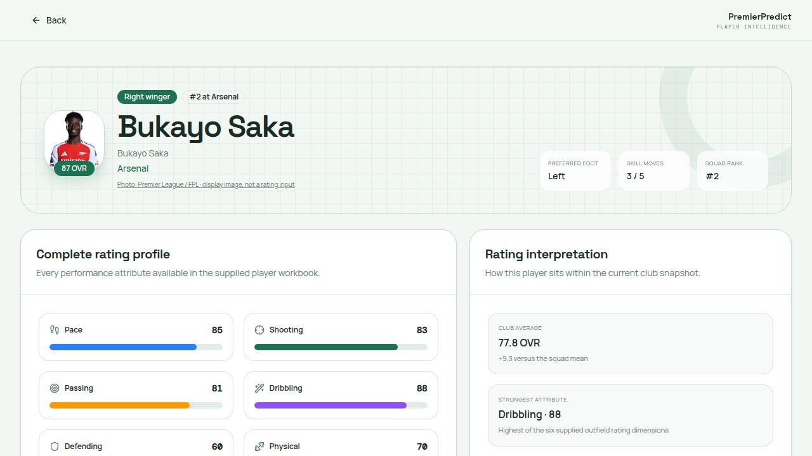
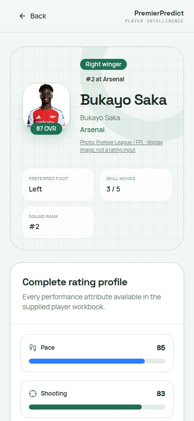
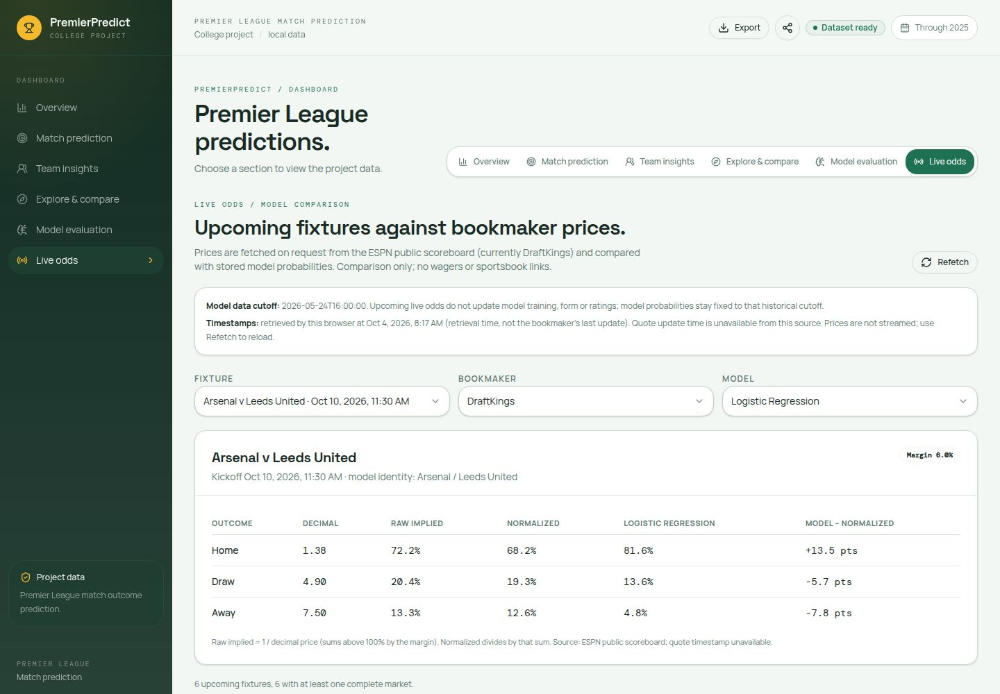
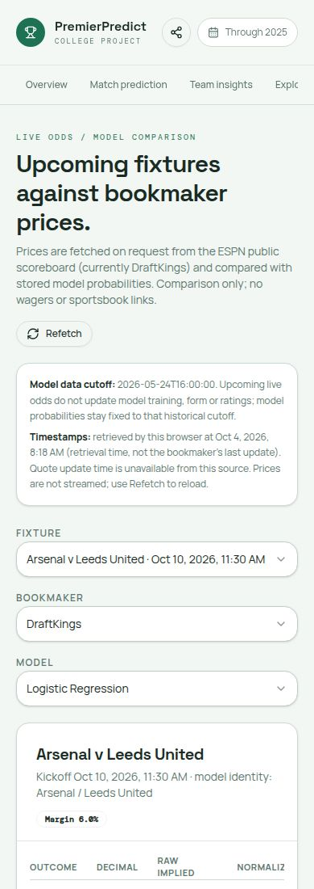
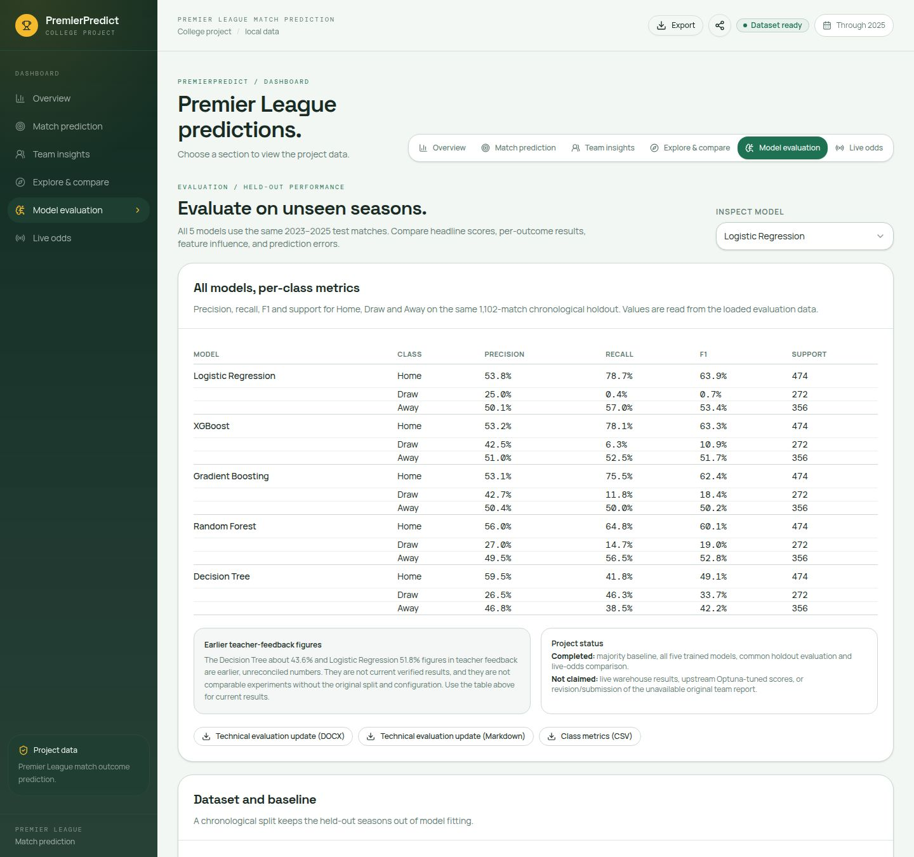

# PremierPredict — verified work evidence, 4 October 2026

This records the modelling, dashboard, live-demo and player-photo work completed
and verified today. It does not claim that a recording, Lab 8, a revised slide
deck or an individual final submission has been completed.

## Individual Jira records

| Work | Jira record | Evidence |
| --- | --- | --- |
| Genuine XGBoost training and holdout evaluation | [TASK-58](https://bishalbhujel112-1786614700282.atlassian.net/browse/TASK-58) | `model_pipeline.py`, `app.py`, `generate_dashboard_data.py`, five-model payload |
| XGBoost parameter export and static browser inference | [TASK-59](https://bishalbhujel112-1786614700282.atlassian.net/browse/TASK-59) | `browser_models.py`, dashboard `src/lib/model-inference.ts`, browser parity tests |
| Season-matched FIFA/FC ratings and training-only imputation | [TASK-60](https://bishalbhujel112-1786614700282.atlassian.net/browse/TASK-60) | `data/`, `model_pipeline.py`, `tests/test_historical_ratings.py` |
| Correct held-out baseline and evaluation support | [TASK-61](https://bishalbhujel112-1786614700282.atlassian.net/browse/TASK-61) | payload `evaluationSummary`, evaluation views, contract tests |
| Actual player photos and explicit unavailable fallbacks | [TASK-62](https://bishalbhujel112-1786614700282.atlassian.net/browse/TASK-62) | portrait downloader, source manifest, 400 local WebP images, tests, screenshots |
| Updated five-model live-demonstration guide | [TASK-63](https://bishalbhujel112-1786614700282.atlassian.net/browse/TASK-63) | `PRATIK_DEMO_GUIDE.md` |
| Real player-removal/model handoff | [TASK-49](https://bishalbhujel112-1786614700282.atlassian.net/browse/TASK-49) — existing record, evidence refreshed | `PlayerRatingScenario.tsx`, numeric browser inference, baseline/reset tests |
| Exact 40 inputs for every fixture | [TASK-53](https://bishalbhujel112-1786614700282.atlassian.net/browse/TASK-53) — existing record, evidence refreshed | `predictionInputs`, `ModelInsightPanel.tsx`, baseline match PDF |
| Automated dashboard regressions | [TASK-57](https://bishalbhujel112-1786614700282.atlassian.net/browse/TASK-57) — existing record, extended to five models | contract/pipeline/parity tests; test transcript below |
| GitHub project publication | [TASK-45](https://bishalbhujel112-1786614700282.atlassian.net/browse/TASK-45) — existing record, new commit evidence | PremierPredict-App `pratik` branch; exact commit attached to Jira |

The broader individual-submission evidence record, TASK-55, remains separate.
Updating the live-demo guide and this ledger does not prove that an individual
report or final submission has been refreshed and submitted.

## Modelling and data facts

- Five distinct models: Logistic Regression, **XGBoost**, sklearn Gradient
  Boosting, Random Forest, Decision Tree.
- **40** numeric predictors; **380** ordered fixtures; **1,900** stored
  predictions.
- **5,952** valid unique matches: **4,850** training matches from season-start
  years 2008–2022 and **1,102** held-out matches from 2023–2025.
- Holdout support: **474 home wins, 272 draws, 356 away wins**.
- Training-majority Home baseline on the holdout: **43.01%**. Full-dataset
  home-win prevalence **45.18%** is not a comparable test baseline.
- **3,734** matches have season-matched 2015–2025 FIFA/FC ratings, including
  every holdout match. **2,218** pre-2015 training matches retain missing
  ratings and availability flags; medians are learned on training rows only.
- History extends to **24 May 2026**. Season labels are start years.
- Standings are explicitly reconstructed from checked-in match results.
  Displayed models use fixed local configurations, not upstream Optuna-tuned
  results, and this demonstration does not query a live Snowflake warehouse.

| Model | Holdout accuracy | Macro F1 | Macro precision |
| --- | ---: | ---: | ---: |
| Logistic Regression | 52.36% | 39.33% | 42.98% |
| XGBoost | 52.09% | 41.98% | 48.90% |
| Gradient Boosting | 51.54% | 43.67% | 48.74% |
| Random Forest | 49.73% | 43.96% | 44.19% |
| Decision Tree | 41.83% | 41.66% | 44.23% |

Payload schema: **5**. Numeric inference artifact version: **3**, including
**600 XGBoost trees**. Its SHA-256 is:

```text
40fd7e6ec36a0928bb0e13395fc79380b70a4c7b9965855fcd20062704cb5486
```

The referenced file is
`artifacts/premierpredict-dashboard/public/data/model-inference-40fd7e6ec36a0928.json`.

## Player exclusion demonstration

The browser recomputes remaining-player average/maximum/availability inputs and
evaluates trained numeric parameters. It does not retrain or manually move
probability points. The original result remains the baseline; Reset restores it.

For the documented Gradient Boosting Arsenal–Manchester United scenario,
excluding Saka and Bruno changes Home/Draw/Away from **55.4/35.6/9.0%** to
**58.5/33.1/8.4%**. Bruno alone leaves this particular result unchanged.
The winning class is still Home. Exclusions need not change the result.
The existing PDF exports the baseline, not the temporary roster scenario.

## Actual player photos

- **400 of 623** roster players have verified, locally cached official
  Premier League/FPL photos.
- **223** players have explicit unavailable fallbacks, including players
  without an unambiguous identity match or a usable source image. These use
  initials, not fabricated/generated or guessed faces.
- Avatars appear in profile headers, squad lists/top-player cards, formation
  pitches, explore cards and player-exclusion controls.
- `src/data/player-portraits.json` records the matched name, FPL code, matching
  method, source URL, image SHA-256, retrieval date and every missing case.
- EA player IDs are not FPL image codes. Matches use full names or unique
  first-and-last names, never surname-only guesses.
- Photos are display assets, may be newer than the ratings snapshot and do
  not change probabilities. Photo rights remain with their owners.

### Visual evidence

Verified desktop and phone renders show the real Saka photo and intact ratings:





## Verification

```sh
cd Premier-League-Predictor
python -m pytest tests -q
# 38 passed in 18.99s

cd ..
pnpm --filter @workspace/premierpredict-dashboard run typecheck
pnpm --filter @workspace/premierpredict-dashboard run build
# Both exited 0.
```

- [Python test transcript](2026-10-04-pytest.txt).
- [React build transcript](2026-10-04-react-build.txt).
- Python/browser parity covers **1,960** model results, including all stored
  fixture/model combinations and additional changed-rating cases.
- Portrait tests verify all 400 local images, source codes, hashes, roster
  coverage accounting, ambiguous-name rejection and three demo players.
- Earlier today, Streamlit AppTest selected XGBoost, generated a prediction
  and displayed its evaluation without an app exception.
- The managed React workflow restarted successfully. Final desktop/mobile
  captures show no browser runtime error. Temporary hot-reload errors while
  the portrait manifest was being downloaded were resolved before delivery.
- Build warnings remain for existing UI source maps and a large bundle;
  neither prevented the successful build.

## Betting-odds audit

The initial audit found no bookmaker integration; a sportsbook-style card alone
was only displaying model probabilities. Following the user's selection of
**live odds for upcoming matches**, a separate Live odds tab now reads actual
scheduled fixtures and complete Home/Draw/Away markets from ESPN's public
scoreboard, currently carrying DraftKings prices. No API key is required.

The supplied project guidance explicitly says **“Betting Odds (optional)”**
at line 149 of the shared project brief. It also mentions Football-Data.co.uk
as a potential dataset with odds. This is not evidence that odds were collected,
used for training, compared against bookmakers or connected live.

This is a current listed-price comparison, **not a new model input or a
historical bookmaker benchmark**. Browser retrieval time is shown; bookmaker
quote-update time is unavailable. Public-feed coverage and availability are
not guaranteed. Upcoming clubs absent from the model's roster are not guessed.
Model probabilities still use historical data ending on 24 May 2026.

The browser verified six real upcoming fixtures, each with a complete market,
on 4 October 2026. Arsenal–Leeds showed decimal Home/Draw/Away prices
1.384615/4.90/7.50; these are a dated observation, not fixed app prices.

## Teacher feedback evaluation update

- Added one consolidated table covering all five models' precision, recall,
  F1 and support separately for Home/Draw/Away.
- All use the same holdout: **11 August 2023 to 24 May 2026**, 1,102 matches;
  training is **16 August 2008 to 28 May 2023**, 4,850 matches.
- Generated a replacement technical section as Word and Markdown, plus an
  18-row CSV including the majority baseline. This does not claim to have
  edited or submitted the unavailable original team report.
- Every published class metric and headline score is checked against the
  confusion matrices before report generation.
- The earlier teacher-feedback Decision Tree ~43.6% and Logistic Regression
  51.8% are documented as unreconciled without their original split/configuration.
- Verification after this addition: **42 Python tests**, **7 live-odds parser
  tests**, React typecheck and production build passed. Desktop odds, phone
  odds and all-model evaluation captures show no browser runtime error.
- Word output rendered successfully through LibreOffice; the class table and
  section boundaries were checked.





## Captain matchup presentation

Live odds, Overview and Match prediction now share a full-body captain-versus
hero, with team-coloured lighting, dimensional podiums and official club emblems.
The Overview team controls share selection state with Match prediction. Live
odds uses the actual selected provider fixture, independently of model coverage.

Figures are generated illustrations, not photographs or a live matchday lineup.
Current captain references come from the Premier League's 2026/27 captain list.
Burnley, West Ham and Wolves are explicitly marked historical 2025/26 references.
Newly promoted Ipswich, Coventry and Hull have their own figures and emblems,
even though those clubs are absent from the model's 2025 roster.

The primary odds presentation now names each outcome and separately labels
model probability, bookmaker margin-normalized probability and decimal price.
Technical calculations and full provenance remain available in expandable
details instead of dominating the main page. No prediction parameters, training
data or bookmaker prices were changed by this visual redesign.

## GitHub scope

Destination: **PRatik0772/PremierPredict-App**, existing **pratik** branch.
The export includes current PremierPredict code, datasets, model artifacts,
player photos, attribution, demo guide and dated test/screenshot evidence.
It excludes new private agent-memory changes, secret files, AWS lab uploads and
unrelated Glassnik products. The main branch is not force-pushed or overwritten.